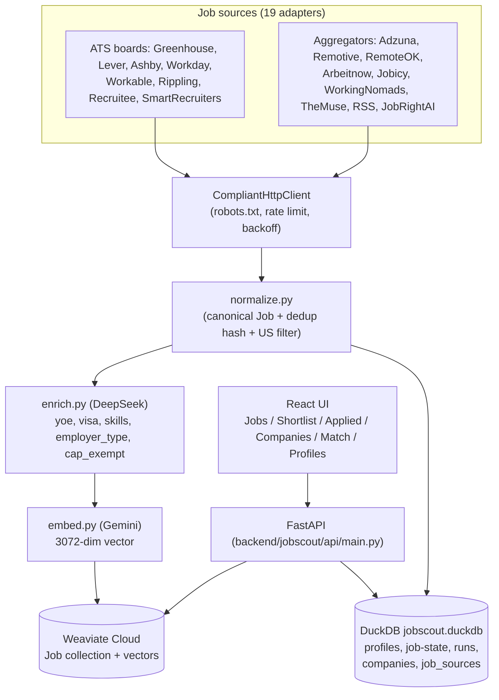
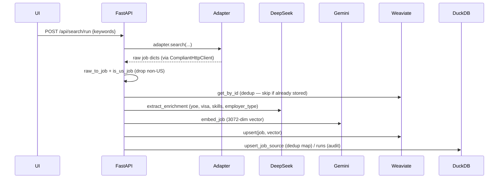

# Architecture

JobScout has three runtime processes (Weaviate, FastAPI backend, React frontend) plus two LLM APIs
(Gemini for embeddings, DeepSeek for enrichment). This page covers the system layout, the ingestion
pipeline, and where each piece of data lives.

> Every Mermaid diagram below is followed by a **plain-text fallback** so it still reads where Mermaid
> doesn't render (e.g. some plain Markdown viewers).

---

## 1. System overview



**Fallback (if the diagram above doesn't render):**

```
Job sources (19 adapters)
  - ATS boards: Greenhouse, Lever, Ashby, Workday, Workable, Rippling, Recruitee, SmartRecruiters
  - Aggregators: Adzuna, Remotive, RemoteOK, Arbeitnow, Jobicy, WorkingNomads, TheMuse, RSS, JobRightAI
        |
        v
  CompliantHttpClient  (robots.txt check, per-domain rate limit, 429/503 backoff)
        |
        v
  normalize.py  ->  enrich.py (DeepSeek)  ->  embed.py (Gemini)  ->  Weaviate Cloud (jobs + vectors)
        |                                                                    ^
        +--> DuckDB (jobscout.duckdb)                                        |
                                                                            |
  FastAPI backend  reads/writes  Weaviate + DuckDB  <-------- React UI ------+
```

---

## 2. Ingestion pipeline (what happens on "Get latest jobs" / refresh)



**Fallback (textual steps):**
1. UI calls `POST /api/search/run` with keywords.
2. Each enabled adapter yields raw job dicts (all HTTP via `CompliantHttpClient`).
3. `raw_to_job` normalizes; `is_us_job` drops non-US roles.
4. If the job's dedup id already exists in Weaviate, skip it (no LLM/embed cost).
5. DeepSeek enriches: years-of-experience, visa stance, skills, seniority, employer type, clearance.
6. `derive_cap_exempt` + `is_known_h1b_sponsor` stamp sponsorship signals.
7. Gemini embeds the job to a 3072-dim vector.
8. Upsert into Weaviate; record source + run in DuckDB.

**Cost note:** every newly-ingested job = 1 DeepSeek call + 1 Gemini embed. The free Gemini tier caps
at 1,000 embeds/day; ingestion and refresh are budget-capped (`embed_daily_budget`, default 800).

---

## 3. Search + matching (read path)

- **Jobs tab** → `GET /api/jobs` runs a Weaviate **hybrid** query (BM25 + vector, blended by `alpha`)
  with metadata filters. When a `profile_id` is supplied, the backend attaches a **verdict** per job
  (Apply/Flag/Reject + fit score + matched/gap keywords), sorts cap-exempt-first, and excludes
  applied/hidden jobs.
- **Match tab** → `POST /api/match/upload` extracts resume text, parses it to a profile (DeepSeek),
  embeds it, and runs a `near_vector` search with the profile's eligibility filters.
- **Verdict engine** (`verdict.py`) is a pure function: hard disqualifiers (explicit no-sponsorship,
  citizenship-required, clearance, too-senior) → reject; otherwise a weighted fit score over title /
  skills / seniority / remote, with matched = resume∩job skills and gaps = job−resume (never invented).

---

## 4. Component map

| Layer | Files |
|---|---|
| Adapters | `backend/jobscout/adapters/*.py` (+ `base.py` = `CompliantHttpClient`) |
| Normalization / dedup | `normalize.py` |
| Enrichment | `enrich.py` (DeepSeek), `sponsors.py` (H-1B), `resume.py` (resume→profile) |
| Embeddings | `embed.py` (Gemini) |
| Stores | `store.py` (Weaviate), `relational.py` (DuckDB) |
| Search / scoring | `search.py`, `verdict.py`, `skills.py` |
| Scheduler | `scheduler.py` (APScheduler, off by default) |
| **Service layer** | `services/source_config.py` (sources.yaml + adapter construction), `services/query_service.py` (dedup, date-range, resume match, semantic scoring, saved-search counts), `services/ingestion_service.py` (ingestion / enrichment / watchlist-refresh background jobs) |
| API | `api/main.py` (FastAPI app + routes; delegates business logic to the service layer) |
| Frontend | `frontend/src/` (React + Vite + TanStack Query + Tailwind) |

Layering: **routes (`api/main.py`) → services (`services/*`) → repositories (`store.py` Weaviate, `relational.py` DuckDB) → schemas (`models.py`)**. Services are stateless functions taking the open stores as parameters. `RelationalStore` serializes its single DuckDB connection with a re-entrant lock (`_synchronized_methods`) because ingestion runs in a background thread alongside request handlers.
