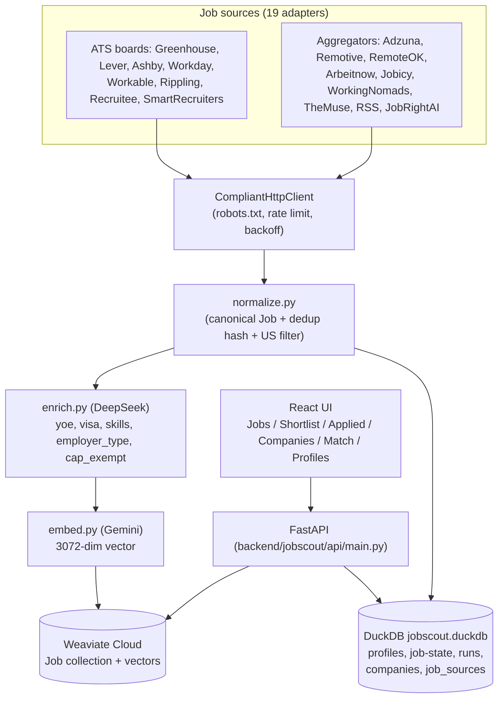
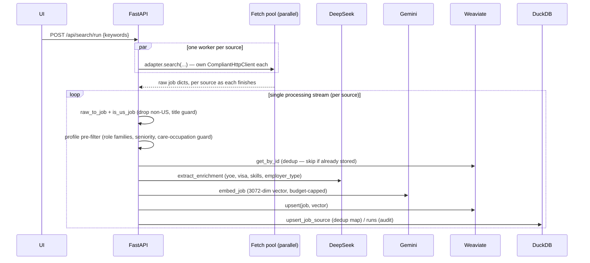
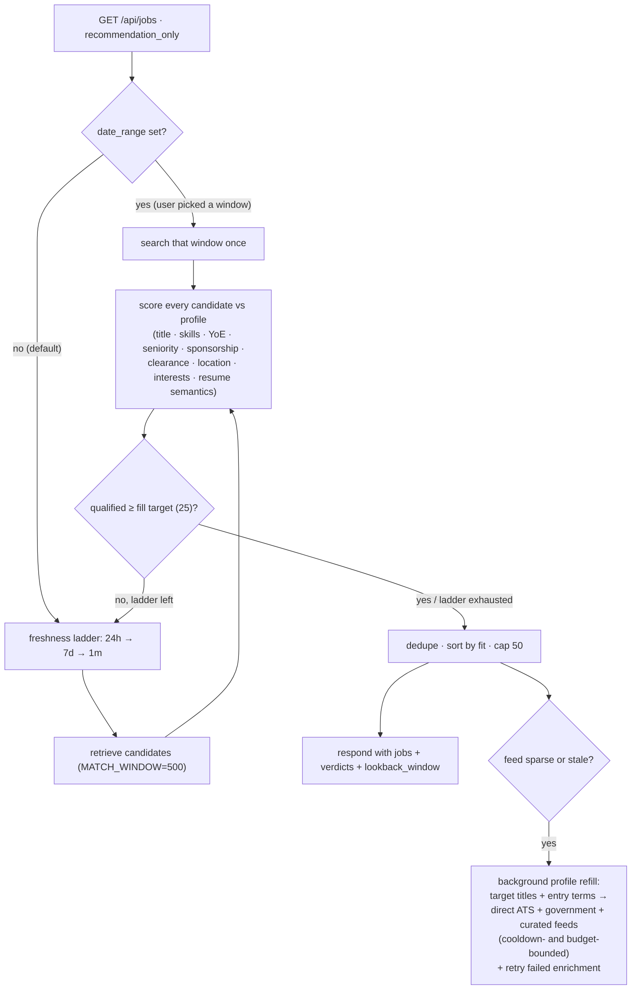
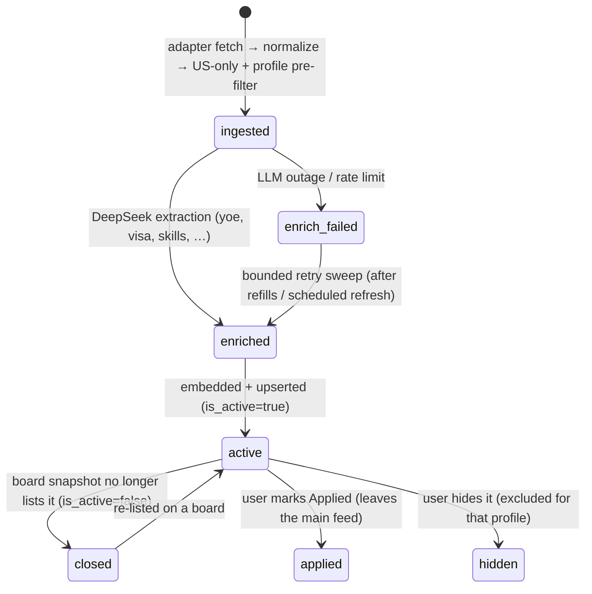
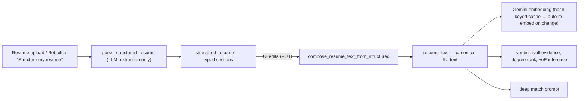
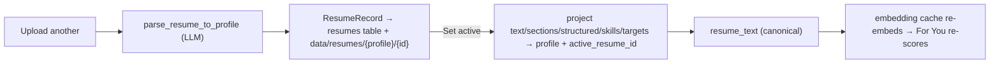
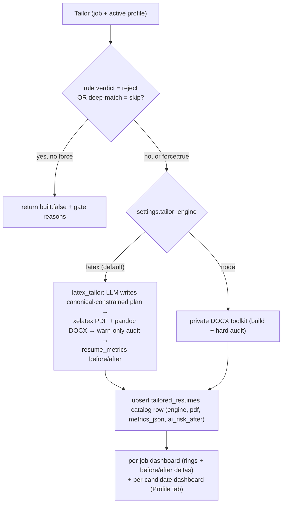
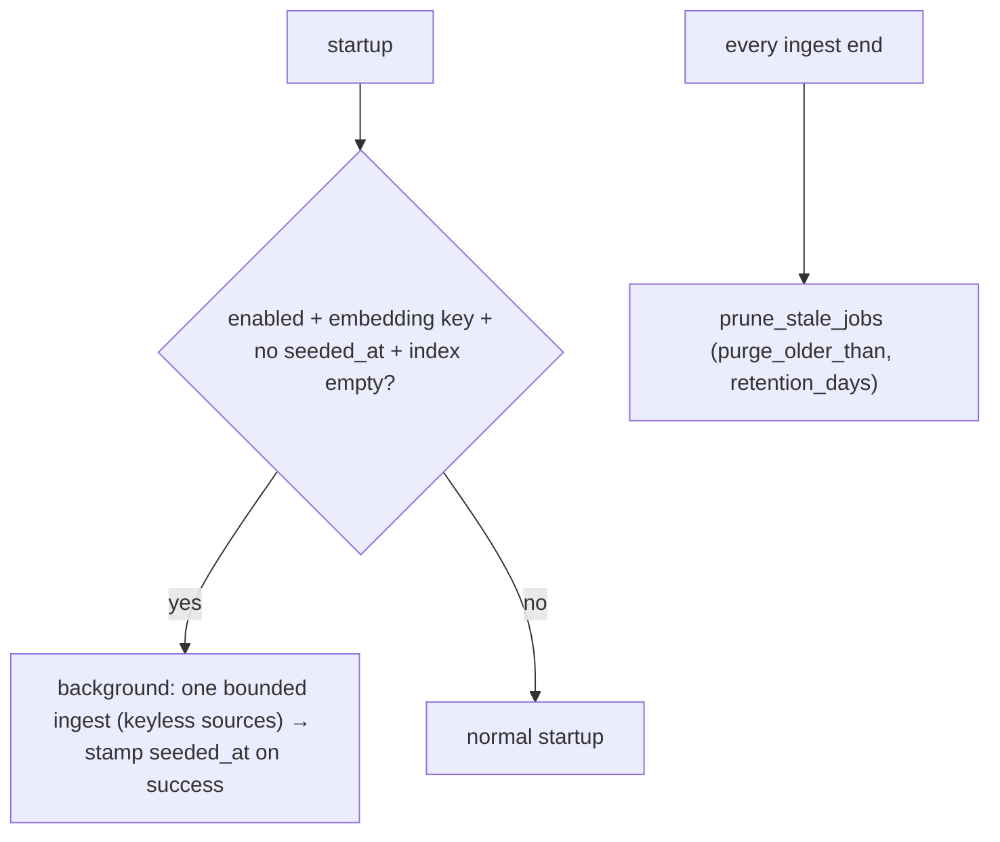

# Architecture

JobScout has three runtime processes (Weaviate, FastAPI backend, React frontend) plus two LLM APIs
(Gemini for embeddings, DeepSeek for enrichment). This page covers the system layout, the ingestion
pipeline, and where each piece of data lives.

> Every Mermaid diagram below is followed by a **plain-text fallback** so it still reads where Mermaid
> doesn't render (e.g. some plain Markdown viewers).

---

## 1. System overview


```mermaid
flowchart TD
    subgraph Sources["Job sources (19 adapters)"]
      ATS["ATS boards: Greenhouse, Lever, Ashby, Workday,<br/>Workable, Rippling, Recruitee, SmartRecruiters"]
      AGG["Aggregators: Adzuna, Remotive, RemoteOK,<br/>Arbeitnow, Jobicy, WorkingNomads, TheMuse, RSS, JobRightAI"]
    end
    HTTP["CompliantHttpClient<br/>(robots.txt, rate limit, backoff)"]
    NORM["normalize.py<br/>(canonical Job + dedup hash + US filter)"]
    ENR["enrich.py (DeepSeek)<br/>yoe, visa, skills, employer_type, cap_exempt"]
    EMB["embed.py (Gemini)<br/>3072-dim vector"]
    WV[("Weaviate Cloud<br/>Job collection + vectors")]
    DUCK[("DuckDB jobscout.duckdb<br/>profiles, job-state, runs,<br/>companies, job_sources")]
    API["FastAPI (backend/jobscout/api/main.py)"]
    UI["React UI<br/>Jobs / Shortlist / Applied / Companies / Match / Profiles"]

    ATS --> HTTP
    AGG --> HTTP
    HTTP --> NORM --> ENR --> EMB --> WV
    NORM --> DUCK
    API --> WV
    API --> DUCK
    UI --> API
```

**Fallback (if the diagram above doesn't render):**

```
Job sources (19 adapters)
  - ATS boards: Greenhouse, Lever, Ashby, Workday, Workable, Rippling, Recruitee, SmartRecruiters
  - Aggregators: Adzuna, Remotive, RemoteOK, Arbeitnow, Jobicy, WorkingNomads, TheMuse, RSS, JobRightAI
        |
        v
  CompliantHttpClient  (robots.txt check, per-domain rate limit, 429/503 backoff)
        |
        v
  normalize.py  ->  enrich.py (DeepSeek)  ->  embed.py (Gemini)  ->  Weaviate Cloud (jobs + vectors)
        |                                                                    ^
        +--> DuckDB (jobscout.duckdb)                                        |
                                                                            |
  FastAPI backend  reads/writes  Weaviate + DuckDB  <-------- React UI ------+
```

---

## 2. Ingestion pipeline (what happens on "Get latest jobs" / refresh)

Fetching is **parallel** (one worker + one `CompliantHttpClient` per source, so per-domain rate
limits/robots are still respected); everything stateful — enrichment, the embed budget, database
writes, run logs — stays on a **single processing stream** (`INGEST_FETCH_WORKERS`, default 6;
`1` restores sequential behavior).


```mermaid
sequenceDiagram
    participant UI
    participant API as FastAPI
    participant P as Fetch pool (parallel)
    participant DS as DeepSeek
    participant GM as Gemini
    participant WV as Weaviate
    participant DK as DuckDB
    UI->>API: POST /api/search/run {keywords}
    par one worker per source
        API->>P: adapter.search(...) — own CompliantHttpClient each
    end
    P-->>API: raw job dicts, per source as each finishes
    loop single processing stream (per source)
        API->>API: raw_to_job + is_us_job (drop non-US, title guard)
        API->>API: profile pre-filter (role families, seniority, care-occupation guard)
        API->>WV: get_by_id (dedup — skip if already stored)
        API->>DS: extract_enrichment (yoe, visa, skills, employer_type)
        API->>GM: embed_job (3072-dim vector, budget-capped)
        API->>WV: upsert(job, vector)
        API->>DK: upsert_job_source (dedup map) / runs (audit)
    end
```

**Fallback (textual steps):**
1. UI calls `POST /api/search/run` with keywords.
2. ALL enabled adapters fetch **in parallel** (a worker + `CompliantHttpClient` per source).
3. As each source finishes, its jobs are processed on one stream:
   `raw_to_job` normalizes; `is_us_job` drops non-US roles (incl. foreign cities hidden in titles).
4. With a profile, a conservative pre-filter (same role-family taxonomy as the verdict engine)
   drops clear mismatches before any LLM spend.
5. If the job's dedup id already exists in Weaviate, skip it (no LLM/embed cost).
6. DeepSeek enriches: years-of-experience, visa stance, skills, seniority, employer type, clearance.
7. `derive_cap_exempt` + `is_known_h1b_sponsor` stamp sponsorship signals.
8. Gemini embeds the job to a 3072-dim vector (per-run budget; quota-stop is clean).
9. Upsert into Weaviate; record source + run in DuckDB.
10. After profile refills / scheduled refreshes, a bounded sweep retries rows whose
    enrichment previously failed (self-healing).

**Cost note:** every newly-ingested job = 1 DeepSeek call + 1 Gemini embed. The free Gemini tier caps
at 1,000 embeds/day; ingestion and refresh are budget-capped (`embed_daily_budget`, default 800).

---

## 3. Search + matching (read path)

- **Jobs tab** → `GET /api/jobs` runs a Weaviate **hybrid** query (BM25 + vector, blended by `alpha`)
  with metadata filters. When a `profile_id` is supplied, the backend attaches a **verdict** per job
  (Apply/Flag/Reject + fit score + matched/gap keywords), sorts cap-exempt-first, and excludes
  applied/hidden jobs.
- **Match tab** → `POST /api/match/upload` extracts resume text, parses it to a profile (DeepSeek),
  embeds it, and runs a `near_vector` search with the profile's eligibility filters.
- **Verdict engine** (`verdict.py`) is a pure function: hard disqualifiers (explicit no-sponsorship,
  citizenship-required, clearance, too-senior) → reject; otherwise a weighted fit score over title /
  skills / seniority / remote, with matched = resume∩job skills and gaps = job−resume (never invented).

---

## 4. Component map

| Layer | Files |
|---|---|
| Adapters | `backend/jobscout/adapters/*.py` (+ `base.py` = `CompliantHttpClient`) |
| Normalization / dedup | `normalize.py` |
| Enrichment | `enrich.py` (DeepSeek), `sponsors.py` (H-1B), `resume.py` (resume→profile) |
| Embeddings | `embed.py` (Gemini) |
| Stores | `store.py` (Weaviate), `relational.py` (`RelationalStore` Protocol + `DuckDBRelationalStore` + `make_relational_store` factory — the DB swap seam), `blob.py` (`BlobStore` + `LocalBlobStore` — the file-storage swap seam) |
| Entitlements | `entitlements.py` (`Limits`, `resolve_limits(user_id)`, `record_usage`, `check_quota` — the single seam every per-account limit/quota resolves through) |
| Guard rails | `security.py` (dormant rate-limit / body-size / security-headers / require-auth middleware, off by default) |
| Observability | `logging_config.py` (`configure_logging`, called at startup) |
| Search / scoring | `search.py`, `verdict.py`, `skills.py` |
| Scheduler | `scheduler.py` (APScheduler, off by default) |
| **Service layer** | `services/source_config.py` (sources.yaml + adapter construction), `services/query_service.py` (dedup, date-range, resume match, semantic scoring, saved-search counts), `services/ingestion_service.py` (ingestion / enrichment / watchlist-refresh background jobs) |
| API | `api/main.py` (FastAPI app + routes; delegates business logic to the service layer), `api/admin.py` (operator/admin console: `/api/admin/*`, require_admin-gated) |
| Tenancy seam | `api/deps.py` (`current_user_id` = the single auth drop-in, `effective_owner`, `owned_profile` = the authz primitive, `require_admin`) + the `enforce_profile_ownership` middleware in `api/main.py` (path routes) with `owned_profile` on query/body routes. Jobs/enrichment/vectors are global; profiles/resumes/tailored/deep-match/saved-searches are per-`user_id` and leak-proof by construction — see [multi-tenancy.md](multi-tenancy.md) |
| Auth (identity) | `auth/auth0.py` (PyJWT JWKS verify) wired into `current_user_id`; frontend `auth/` (`@auth0/auth0-react` provider + login gate + token injection). Env-gated — see [auth-and-hosting.md](auth-and-hosting.md) |
| Data backends (swappable seams) | Relational: `RelationalStore` Protocol → `DuckDBRelationalStore` (local/test) or `PostgresRelationalStore` (Supabase, psycopg pool). Files: `BlobStore` Protocol → `LocalBlobStore` or `SupabaseBlobStore`. Factories `make_relational_store`/`make_blob_store` pick by env. Weaviate (vectors) unchanged |
| Frontend | `frontend/src/` (React + Vite + TanStack Query + Tailwind) |

Layering: **routes (`api/main.py`) → services (`services/*`) → repositories (`store.py` Weaviate, `relational.py` DuckDB) → schemas (`models.py`)**. Services are stateless functions taking the open stores as parameters. `RelationalStore` serializes its single DuckDB connection with a re-entrant lock (`_synchronized_methods`) because ingestion runs in a background thread alongside request handlers.

---

## 5. "For You" query flow (recommendation path)

`GET /api/jobs?recommendation_only=true&profile_id=…&sort=match&target_min=N` — the strict
profile-backed feed. Only roles whose **verdict is recommendable** appear (every fit gate passed;
the only allowed caveat is "sponsorship not stated" at a sponsorship-favorable employer).


```mermaid
flowchart TD
    Q[GET /api/jobs · recommendation_only] --> L{date_range set?}
    L -- "yes (user picked a window)" --> W[search that window once]
    L -- "no (default)" --> R["freshness ladder: 24h → 7d → 1m"]
    R --> S["retrieve candidates (MATCH_WINDOW=500)"]
    S --> V["score every candidate vs profile\n(title · skills · YoE · seniority · sponsorship ·\nclearance · location · interests · resume semantics)"]
    V --> F{"qualified ≥ fill target (25)?"}
    F -- no, ladder left --> R
    F -- "yes / ladder exhausted" --> C["dedupe · sort by fit · cap 50"]
    W --> V
    C --> O[respond with jobs + verdicts + lookback_window]
    C --> T{"feed sparse or stale?"}
    T -- yes --> B["background profile refill:\ntarget titles + entry terms →\ndirect ATS + government + curated feeds\n(cooldown- and budget-bounded)\n+ retry failed enrichment"]
```

Notes:
- The ladder **fills** (keeps widening until ~25 qualified or the ladder ends) rather than stopping at
  the first rung with a handful of hits; the display cap is 50.
- Picking any value in the **Date posted** pill bypasses the ladder and searches exactly that window.
- The refill hashes the whole profile into its key, so **editing the profile re-drives the feed**.

---

## 6. Job lifecycle


```mermaid
stateDiagram-v2
    [*] --> ingested: adapter fetch → normalize → US-only + profile pre-filter
    ingested --> enriched: DeepSeek extraction (yoe, visa, skills, …)
    ingested --> enrich_failed: LLM outage / rate limit
    enrich_failed --> enriched: bounded retry sweep (after refills / scheduled refresh)
    enriched --> active: embedded + upserted (is_active=true)
    active --> closed: board snapshot no longer lists it (is_active=false)
    closed --> active: re-listed on a board
    active --> applied: user marks Applied (leaves the main feed)
    active --> hidden: user hides it (excluded for that profile)
```


## 7. Structured resume data flow


```mermaid
flowchart LR
    U[Resume upload / Rebuild / “Structure my resume”] --> P["parse_structured_resume (LLM, extraction-only)"]
    P --> SR[structured_resume — typed sections]
    SR -- UI edits (PUT) --> C[compose_resume_text_from_structured]
    C --> RT[resume_text — canonical flat text]
    RT --> E["Gemini embedding (hash-keyed cache → auto re-embed on change)"]
    RT --> V[verdict: skill evidence, degree rank, YoE inference]
    RT --> D[deep match prompt]
```

`resume_text` remains the single canonical matching source; the typed sections are its editable
projection, kept in sync in both directions.

## 8. Resume library (many resumes, one active)


```mermaid
flowchart LR
    UP["Upload another"] --> PARSE["parse_resume_to_profile (LLM)"]
    PARSE --> REC["ResumeRecord → resumes table + data/resumes/{profile}/{id}"]
    REC -->|Set active| PROJ["project text/sections/structured/skills/targets → profile + active_resume_id"]
    PROJ --> RT["resume_text (canonical)"]
    RT --> MATCH["embedding cache re-embeds → For You re-scores"]
```

The library is a table behind the profile: a profile holds many `ResumeRecord`s but the **active** one
is projected onto the profile's `resume_*` fields (§7). Because everything downstream reads the profile,
no matching code changes — switching the active resume just re-projects and clears the verdict cache.
Pre-library single uploads are lazily adopted as record 0 on first library view.

## 9. Tailoring flow (pre-flight gate + catalog)


```mermaid
flowchart TD
    T["Tailor (job + active profile)"] --> G{"rule verdict = reject<br/>OR deep-match = skip?"}
    G -->|yes, no force| STOP["return built:false + gate reasons"]
    G -->|no, or force:true| E{"settings.tailor_engine"}
    E -->|"latex (default)"| L["latex_tailor: LLM writes canonical-constrained plan →<br/>xelatex PDF + pandoc DOCX → warn-only audit →<br/>resume_metrics before/after"]
    E -->|node| N["private DOCX toolkit (build + hard audit)"]
    L --> CAT["upsert tailored_resumes catalog row (engine, pdf, metrics_json, ai_risk_after)"]
    N --> CAT
    CAT --> DASH["per-job dashboard (rings + before/after deltas)<br/>+ per-candidate dashboard (Profile tab)"]
```

The deterministic JD gate (US-only, no citizenship/clearance/ITAR wall, no explicit no-sponsorship, not a
5+-year role) runs before any model tokens are spent; a *skip* conclusion is overridable with `force`.
`build_tailored_resume` dispatches on `settings.tailor_engine`. The default **LaTeX engine**
(`latex_tailor.py`) is multi-candidate: it constrains the LLM to the profile's *own* resume facts, renders
a fixed template (deterministic escaped injection, never model-authored LaTeX), builds a **PDF + DOCX**,
runs a warn-only fabrication audit, and scores before/after **AI-reduction metrics** (`resume_metrics.py`,
a pure-Python lightweight suite). The legacy `node` engine keeps the private-toolkit DOCX path. Every build
is catalogued (with metrics) and drives the native-React per-job and per-candidate dashboards.

## 10. First-run seed + retention


```mermaid
flowchart TD
    B["startup"] --> Q{"enabled + embedding key +<br/>no seeded_at + index empty?"}
    Q -->|yes| S["background: one bounded ingest (keyless sources) → stamp seeded_at on success"]
    Q -->|no| N["normal startup"]
    I["every ingest end"] --> P["prune_stale_jobs (purge_older_than, retention_days)"]
```

Jobs are filled live, never shipped as a committed snapshot (they go stale). The seed runs once; retention
keeps the index a rolling recent window past the ghost-risk threshold. See
[data-and-storage.md](data-and-storage.md).
