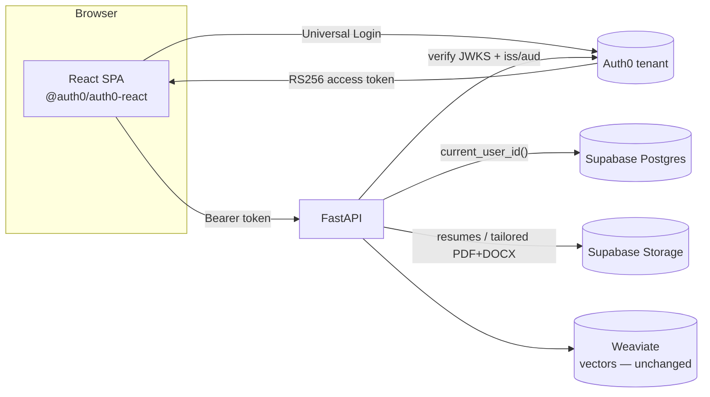

# Authentication & hosting (Auth0 + Supabase)

JobScout runs as a single local user out of the box. To host it for multiple users it
uses the same split as the Leelaa project: **Auth0** for identity and **Supabase** for
the database (Postgres) and file storage. Everything is env-gated — with none of the
variables set, behavior is byte-identical to the local single-user app, and the vector
DB (Weaviate) is unchanged in every mode.



## What each service does

| Concern | Component | Seam it plugs into |
|---|---|---|
| Login / identity | Auth0 Universal Login (SPA) → RS256 JWT | `api/deps.current_user_id` (verify + resolve user) |
| Relational data (profiles, resumes index, pipeline, saved searches, users) | Supabase Postgres | `RelationalStore` Protocol → `PostgresRelationalStore` |
| Files (uploaded resumes, tailored PDF/DOCX) | Supabase Storage | `BlobStore` Protocol → `SupabaseBlobStore` |
| Search + vectors | Weaviate (unchanged) | — |

Tenancy is enforced **in the app** (every private route runs through `owned_profile`,
404-not-403), so the backend connects to Postgres with the service role and **no RLS
policies are required**.

## One-time setup

### 1. Auth0
1. In your Auth0 tenant, create an **API** (Applications → APIs). Its *Identifier* is your
   `AUTH0_AUDIENCE` (e.g. `https://api.jobscout.app`).
2. Create a **Single Page Application**. Note its **Client ID**.
3. In the SPA settings, add your web origin (e.g. `http://localhost:5173`) to **Allowed
   Callback URLs**, **Allowed Logout URLs**, and **Allowed Web Origins**.
4. (Recommended) Add a login Action that puts the user's email on the access token — the
   backend reads `email` (or a namespaced `.../email` claim) to auto-link accounts.

### 2. Supabase
1. Create a project. From **Settings → Database**, copy the connection string →
   `SUPABASE_DB_URL` (or `DATABASE_URL`).
2. From **Settings → API**, copy the project URL → `SUPABASE_URL` and the **service_role**
   key → `SUPABASE_SERVICE_KEY` (server-side only — never ship it to the browser).
3. Create a **Storage bucket** (default name `jobscout-files`) → `SUPABASE_STORAGE_BUCKET`.

### 3. Environment
Backend `.env` (see `env.example`):
```
AUTH0_DOMAIN=dev-xyz.us.auth0.com
AUTH0_AUDIENCE=https://api.jobscout.app
REQUIRE_AUTH=true
SUPABASE_DB_URL=postgresql://…            # switches the relational store to Postgres
SUPABASE_URL=https://<ref>.supabase.co
SUPABASE_SERVICE_KEY=<service_role key>
SUPABASE_STORAGE_BUCKET=jobscout-files
STORAGE_BACKEND=auto                      # auto → Supabase when the 3 vars above are set
```
Frontend `frontend/.env` (see `frontend/.env.example`):
```
VITE_AUTH0_DOMAIN=dev-xyz.us.auth0.com
VITE_AUTH0_CLIENT_ID=<SPA client id>
VITE_AUTH0_AUDIENCE=https://api.jobscout.app
```

### 4. Migrating existing local data (optional)
Move a local DuckDB store into Postgres once:
```
python scripts/migrate_duckdb_to_postgres.py --duckdb ./jobscout.duckdb --postgres "$SUPABASE_DB_URL"
```
Idempotent (`ON CONFLICT DO NOTHING`).

## How it behaves by configuration

| Env set | Relational | Files | Login |
|---|---|---|---|
| none | DuckDB (`./jobscout.duckdb`) | local disk | none — single local user |
| `AUTH0_DOMAIN` only | DuckDB | local disk | Auth0; users provisioned in DuckDB |
| `+ SUPABASE_DB_URL` | **Supabase Postgres** | local disk | Auth0 |
| `+ SUPABASE_URL/KEY/BUCKET` | Supabase Postgres | **Supabase Storage** | Auth0 |

`REQUIRE_AUTH=true` returns 401 to unauthenticated calls once Auth0 is configured; leave it
false to keep an open local fallback while wiring things up.

## Notes & limits
- **Dev without Docker/Supabase:** the full test suite runs on in-memory DuckDB; the
  Postgres integration test spins up a throwaway Postgres in Docker (or uses
  `TEST_DATABASE_URL`) and skips when neither is available.
- **Single-connection vs pool:** DuckDB serializes on one connection + a lock; the Postgres
  store uses a psycopg pool with a no-op lock, so requests run concurrently.
- **Service key safety:** `SUPABASE_SERVICE_KEY` and the Postgres DSN are backend-only. The
  browser only ever sees the Auth0 domain/client-id/audience (`VITE_*`).
