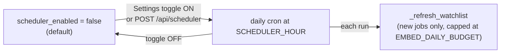

# Configuration

Three config surfaces: `.env` (secrets + runtime), `sources.yaml` (which sources/companies), and a few
YAML policy files. Everything is read relative to the **repo root** — run the backend from there.

---

## `.env` (copy from `env.example`)

| Key | Purpose | Notes |
|---|---|---|
| `GOOGLE_API_KEY` | Gemini embeddings | Required for ingest + text search. Use a `gemini-embedding-*` model. |
| `EMBED_MODEL` | Embedding model | Default `gemini-embedding-001` (3072-dim). The spec's `text-embedding-005` is Vertex-only and 404s on the Gemini API. |
| `DEEPSEEK_API_KEY` | Enrichment + resume parse | `deepseek-chat` via OpenAI-compatible client. |
| `DEEPSEEK_BASE_URL` / `DEEPSEEK_MODEL` | DeepSeek client | Defaults provided. |
| `WEAVIATE_CLUSTER_URL` + `WEAVIATE_API_KEY` | Weaviate Cloud | When both set, connects to the cloud cluster; otherwise uses `WEAVIATE_URL` (local Docker). |
| `WEAVIATE_URL` | Local Weaviate | Default `http://localhost:8080`. |
| `ADZUNA_APP_ID` / `ADZUNA_APP_KEY` | Adzuna source | Optional. |
| `RELATIONAL_DB_PATH` | DuckDB file | Default `./jobscout.duckdb`. |
| `EMBED_DAILY_BUDGET` | Max embeds per ingest/refresh run | Default `500`. The Gemini free tier is 1,000 embeds/day **shared** with search + resume-match, so this reserves ~half the day's quota for searching. |
| `SCHEDULER_ENABLED` | Daily auto-refresh | Default `false`. Toggle at runtime via Settings or `POST /api/scheduler`. |
| `SCHEDULER_HOUR` | Hour to run the daily refresh | Default `6`. |

> The app reads **`.env`** (with the leading dot). `env.example` is the template.

---

## The daily scheduler

**Fallback (textual):** the scheduler is **off by default**. Turn it on in the UI (Settings) or
`POST /api/scheduler {"enabled": true}`; it then runs `_refresh_watchlist` once a day at
`SCHEDULER_HOUR`, ingesting only new jobs and stopping at `EMBED_DAILY_BUDGET` embeds. Turn it off the
same way. Both the manual **Get latest jobs** button and **Refresh watchlist** work regardless.

**Why off by default:** a daily crawl of many companies can exceed the free Gemini embedding tier
(1,000/day). Run manually, or enable the scheduler after moving to a paid tier / local embeddings.

---

## `sources.yaml`

Per-source `enabled` flag + curated company/account/tenant lists. See
[sources.md](sources.md) for the `{token, type}` entry shape and discovery scripts. Auto-discovered
companies live in `sources.discovered.yaml` (generated; merged into `sources.yaml` at load, deduped).

## Policy files

| File | Purpose |
|---|---|
| `compliance.yaml` | robots.txt enforcement, per-domain rate limit, User-Agent, `collect_personal_data: false`. |
| `blocklist.yaml` | Domains/companies to never source from. |
| `docker-compose.yml` | Local Weaviate container. |

## Embedding consistency (important)
Jobs and resumes must be embedded with the **same** model. Changing `EMBED_MODEL` requires re-embedding
the whole index — don't mix models in one Weaviate collection.

## Embedding budget & quota (`EMBED_DAILY_BUDGET`)
Every **new** job is embedded once (Gemini) before it can be stored — the free tier allows **1,000
embeds/day**. **Both** ingest buttons use it: "Get latest jobs" (`_run_ingestion`) and "Get companies"
(`_refresh_watchlist`) each embed via Gemini + enrich via DeepSeek. `EMBED_DAILY_BUDGET` (default 500) caps
embeds **per run for both**, so a single click can't exhaust the whole day's quota; both also stop cleanly
on a 429 (no crash).

**Already-indexed jobs are skipped** (no re-embed — vectors are deterministic), so the budget is spent only
on *new* jobs and a run can add **up to `EMBED_DAILY_BUDGET` new jobs** rather than re-embedding what you
already have. How many it actually adds is bounded by how many *unseen* matching postings the fetch surfaces
— "Get latest jobs" requests `results_wanted=250` per source to backfill toward the budget; raise it to go
deeper, lower it for lighter/faster runs. Once you've caught up with the boards, runs taper to genuine new
arrivals.

The current quota state is exposed as **`embed_quota_exhausted`** on `GET /api/stats` — set the moment an
embed hits the provider 429, **cleared on the next successful embed** (so it auto-recovers after the daily
reset). The UI reads it for a single, self-clearing banner: a run with quota headroom shows "Fetch
started…" first and only flips to the amber *"Embedding quota reached — resumes after the daily reset"*
warning if it actually exhausts the quota; if the quota is already gone it shows amber up front. Existing
jobs are unaffected; already-indexed jobs are skipped before embedding, so re-running costs nothing. The
permanent fix for the 1,000/day ceiling is a paid Gemini tier or a local embedding model (planned).

## Weaviate backup (`EXPORT_AFTER_INGEST`)
`EXPORT_AFTER_INGEST` (default `false`): when `true`, a Weaviate backup
(`scripts/export_weaviate.py` → `data/weaviate_export.jsonl.gz`) runs automatically at the end of each
ingest so the local export stays fresh. It's a pure $0 download (no embedding). Leave it off to back up
on demand instead (`python scripts/export_weaviate.py`). Restore with `scripts/import_weaviate.py`. See
`docs/data-and-storage.md`.
