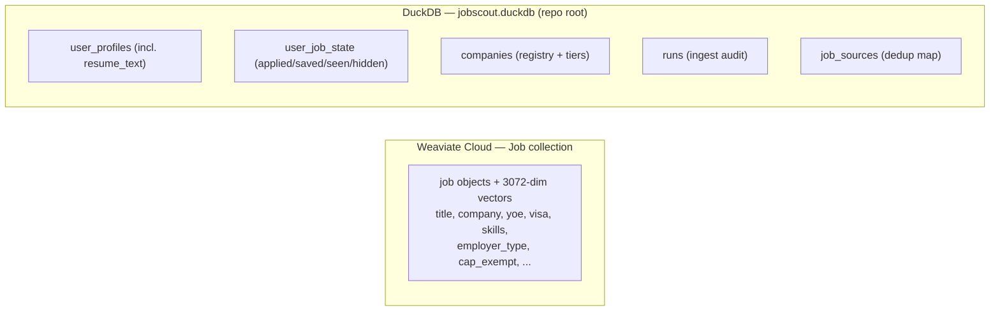

# Data & storage

Where everything is saved, and how to delete it. JobScout is **single-user and local** — no accounts,
no server-side multi-tenant store.

---

## Two stores



**Fallback (textual):**
- **Weaviate Cloud**, `Job` collection: every job + its embedding vector and all enriched fields.
- **DuckDB** at `./jobscout.duckdb` (repo root), tables:
  - `user_profiles` — saved profiles as a JSON blob, including the raw `resume_text`.
  - `user_job_state` — your applied / saved / seen / hidden marks per profile+job.
  - `companies` — the company registry (ATS, slug, tier, H-1B flag, etc.).
  - `runs` — ingestion run audit log.
  - `job_sources` — canonical job_id → every source/URL that listed it (dedup).

---

## Profiles (the thing you asked about)

- **Saved to:** `jobscout.duckdb` → `user_profiles` table, one row per profile, the profile serialized
  as a **JSON blob** (`data` column) plus `id` and `label`. The blob includes your extracted skills,
  target titles, years, sponsorship need, and the **raw resume text** (so matches are re-derivable
  without re-uploading).
- **Created by:** dropping a resume in the **Match** tab (`POST /api/match/upload`).
- **Deleted from the UI:** **Profiles** tab → *Delete*, or the **Match** tab's *Delete profile* button.
  Both call `DELETE /api/profiles/{id}`, which also removes that profile's `user_job_state` rows.

## Sponsorship & E-Verify signals (advisory)

- `known_h1b_sponsor` (per job) — company is in a curated list of public DoL H-1B filers.
- `known_everify` (per job) — company is a known **E-Verify** participant. **Why it matters:** the
  24-month STEM OPT extension legally requires the employer to be enrolled in E-Verify.
- Both come from **curated, advisory** lists (`data/h1b_sponsors.txt`, `data/everify_employers.txt`),
  matched by normalized company name. USCIS offers no clean bulk E-Verify feed and warns *absence does
  not imply non-enrollment* — so a missing badge means **unknown**, never "not E-Verified". Always
  confirm on e-verify.gov before relying on it. Extend the lists freely as you verify employers.
- They are **separate** from `sponsorship_likelihood` (visa/cap-exempt/citizenship) on purpose:
  E-Verify (STEM OPT) and H-1B sponsorship are different legal mechanisms.

## Resumes & PII

- Resume files are read **in memory** to extract text; the file itself is not retained, only the
  extracted text + parsed profile.
- JobScout never scrapes or stores **people's** contact details (recruiter emails, etc.). Company data
  (names, careers URLs, public job postings) is public. See `compliance.yaml`.

## Retention / reset

- Delete a profile → its profile row + job-state rows are gone.
- To wipe local state entirely: stop the backend and delete `jobscout.duckdb` (+ `.duckdb.wal`). Jobs
  in Weaviate persist independently; manage those via the Weaviate console or a fresh collection.

## Backups & the "three copies" caveat

`jobscout.duckdb` is a single file — copy it to back up local state. Avoid editing the project from
multiple synced copies (e.g. Dropbox) at once; that has caused `.duckdb` sync conflicts. Prefer one
working directory under version control.

## Weaviate index backup (jobs + vectors)

The jobs live in **Weaviate** (cloud or local), *not* in a local file — so a folder/Dropbox copy does **not**
contain them. To make them durable, export the index to a file:

```bash
python scripts/export_weaviate.py                 # → data/weaviate_export.jsonl.gz
python scripts/import_weaviate.py                 # restore from that file
```

- The export uses `include_vector=True`, so it captures each job **plus its already-computed vector**.
  Restore writes those vectors straight back — **no embedding calls, no Gemini quota** ($0). It's a pure
  file download/upload, *not* a re-embed.
- The file is gzipped JSONL: line 1 is a header `{embed_backend, embed_model, dim, count, exported_at}`;
  each later line is `{job, vector}`. ~1,300 jobs ≈ 40 MB. It rides along in your Dropbox copy.
- **Mismatch guard:** import refuses if the target index already holds vectors of a different dimension
  (i.e. a different embedding model) — you can't mix models in one collection.
- **Keep it fresh automatically (opt-in):** set `EXPORT_AFTER_INGEST=true` in `.env` to re-export at the
  end of each ingest (data only changes on ingest). Off by default. See `docs/configuration.md`.
- The export holds today's Gemini (3072-dim) vectors, so it restores into a Gemini-backed Weaviate. Moving
  to a local embedding model later is a separate re-embed, not an import.
