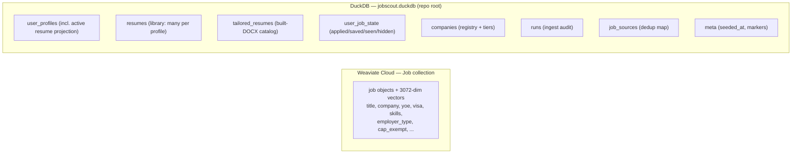
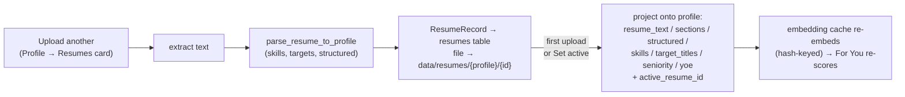
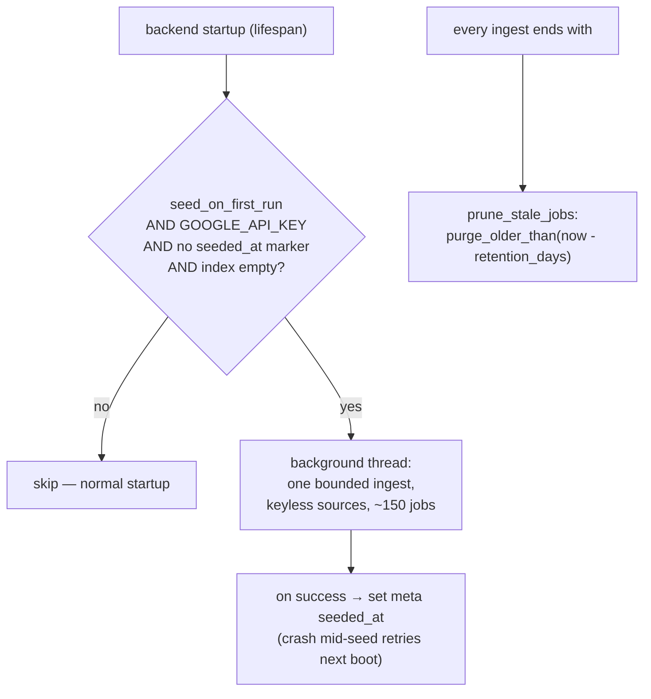

# Data & storage

Where everything is saved, and how to delete it. JobScout is **single-user and local** — no accounts,
no server-side multi-tenant store.

---

## Two stores


```mermaid
flowchart LR
    subgraph WV["Weaviate Cloud — Job collection"]
      J["job objects + 3072-dim vectors<br/>title, company, yoe, visa, skills,<br/>employer_type, cap_exempt, ..."]
    end
    subgraph DK["DuckDB — jobscout.duckdb (repo root)"]
      P["user_profiles (incl. active resume projection)"]
      RES["resumes (library: many per profile)"]
      T["tailored_resumes (built-DOCX catalog)"]
      S["user_job_state (applied/saved/seen/hidden)"]
      C["companies (registry + tiers)"]
      R["runs (ingest audit)"]
      JS["job_sources (dedup map)"]
      M["meta (seeded_at, markers)"]
    end
```

**Fallback (textual):**
- **Weaviate Cloud**, `Job` collection: every job + its embedding vector and all enriched fields.
- **DuckDB** at `./jobscout.duckdb` (repo root), tables:
  - `user_profiles` — saved profiles as a JSON blob. Includes the **active resume projection**
    (`resume_text`, `resume_sections`, `structured_resume`) plus `active_resume_id`.
  - `resumes` — the **resume library**: many `ResumeRecord` rows per profile (one JSON blob each).
    Exactly one is active; activating a resume copies its text/sections/structured/skills/targets onto
    the profile, so every matching path keeps reading the profile unchanged.
  - `tailored_resumes` — catalog of built tailored DOCX files (one row per `(profile_id, job_id)`),
    so they stay listable/downloadable long after the build response.
  - `user_job_state` — your applied / saved / seen / hidden marks per profile+job.
  - `companies` — the company registry (ATS, slug, tier, H-1B flag, etc.).
  - `runs` — ingestion run audit log.
  - `job_sources` — canonical job_id → every source/URL that listed it (dedup).
  - `deep_match_cache` — persisted AI deep-match verdicts, one row per (job, profile) keyed by a
    fingerprint of the profile+resume+job. A score is computed once and never re-billed (survives
    restart); a changed resume/profile flips the fingerprint so the old score is treated as stale.
  - `meta` — small key→value markers (e.g. `seeded_at` for the one-time first-run seed).
  - `users` — one row per account (`id, email, display_name, auth_provider, auth_subject, plan,
    limits_json, is_admin, created_at`). `plan`/`limits_json` are the per-account **entitlements** hook
    (`limits_json` is an open override map); `is_admin` gates the operator API. Seeded with one local user.
  - `usage_counters` — per-account usage ledger `(user_id, metric, period, count)` for monitoring +
    dormant quota enforcement. Written only when `usage_metering_enabled` or `quota_enforced` is on.

**Global vs per-user.** Jobs, enrichment, vectors, `companies`, `runs`, `job_sources`, and `meta` are
**global** (shared by every user — a job is fetched/embedded once and serves all). `user_profiles` and
`saved_searches` carry a `user_id` (inside the JSON blob; legacy empty → the local user), and the child
tables (`resumes`, `tailored_resumes`, `deep_match_cache`, `user_job_state`) inherit tenancy through
`profile_id`. Ownership is enforced in one middleware so nothing crosses accounts — see
[multi-tenancy.md](multi-tenancy.md).

The registry is repopulated idempotently at startup from `sources.yaml`,
`sources.discovered.yaml`, and `data/company_targets.yaml`. Deleting DuckDB does not lose the curated
company list; only live fields such as last-checked timestamps and observed open-role counts reset.

---

## Profiles (the thing you asked about)

- **Saved to:** `jobscout.duckdb` → `user_profiles` table, one row per profile, the profile serialized
  as a **JSON blob** (`data` column) plus `id` and `label`. The blob includes your extracted skills,
  target titles, years, sponsorship need, the **raw resume text**, and source-ordered `resume_sections`
  (education, work experience, projects, publications, achievements, and custom headings), so no text is
  discarded between upload and matching.
- **Created by:** dropping a resume in the **Match** tab (`POST /api/match/upload`).
- **Editable:** the Profile workspace exposes the full extracted text, skills, target roles, experience,
  work preferences, and sponsorship preference. Saving makes that text the canonical input for semantic
  and deep matching; *Rebuild fields from resume* explicitly refreshes the structured fields from it.
- **Deleted from the UI:** **Profiles** tab → *Delete*, or the **Match** tab's *Delete profile* button.
  Both call `DELETE /api/profiles/{id}`, which also removes that profile's `user_job_state` rows.

## Sponsorship & E-Verify signals (advisory)

- `known_h1b_sponsor` (per job) — company is in a curated list of public DoL H-1B filers.
- `known_everify` (per job) — company is a known **E-Verify** participant. **Why it matters:** the
  24-month STEM OPT extension legally requires the employer to be enrolled in E-Verify.
- Both come from **curated, advisory** lists (`data/h1b_sponsors.txt`, `data/everify_employers.txt`),
  matched by normalized company name. USCIS offers no clean bulk E-Verify feed and warns *absence does
  not imply non-enrollment* — so a missing badge means **unknown**, never "not E-Verified". Always
  confirm on e-verify.gov before relying on it. Extend the lists freely as you verify employers.
- They are **separate** from `sponsorship_likelihood` (visa/cap-exempt/citizenship) on purpose:
  E-Verify (STEM OPT) and H-1B sponsorship are different legal mechanisms.

## Resume library (many resumes, one active)

A profile can hold several resumes; exactly one is **active** and drives all matching. Switching the
active resume re-projects its content onto the profile — no code downstream of the profile changes.


```mermaid
flowchart LR
    U["Upload another<br/>(Profile → Resumes card)"] --> X["extract text"]
    X --> PP["parse_resume_to_profile<br/>(skills, targets, structured)"]
    PP --> REC["ResumeRecord → resumes table<br/>file → data/resumes/{profile}/{id}"]
    REC -->|first upload<br/>or Set active| PROJ["project onto profile:<br/>resume_text / sections / structured /<br/>skills / target_titles / seniority / yoe<br/>+ active_resume_id"]
    PROJ --> MATCH["embedding cache re-embeds<br/>(hash-keyed) → For You re-scores"]
```

**Fallback (textual):** upload → extract text → parse (one LLM call) → store a `ResumeRecord` and the
original file under `data/resumes/{profile_id}/{resume_id}.{ext}`. The first upload auto-activates;
otherwise the user clicks *Set active*. Activating copies that resume's text/sections/structured view
and derived skills/targets/seniority onto the profile and clears the verdict cache, so the hash-keyed
resume-embedding cache re-embeds and For You re-scores automatically. Deleting the active resume
promotes the next-newest. User *preferences* (sponsorship, clearance, remote, interests) are never
overwritten by a resume switch — they describe the person, not the document.

## Resumes & PII

- The active resume's complete extracted text is stored in DuckDB for editing and matching. Every
  uploaded file is retained locally under `data/resumes/` (`{profile_id}/{resume_id}.{ext}` for library
  uploads; a flat `{profile_id}.{ext}` for pre-library ones) so it can be downloaded again from the
  Profile workspace. That folder is gitignored and is deleted with its profile; it is never uploaded by
  JobScout.
- Audited tailored DOCX files live at `data/tailored-resumes/{profile_id}/` and are also local-only,
  gitignored, and removed when that profile is deleted. Each build is catalogued in `tailored_resumes`
  so it stays downloadable (with a dated filename) from the Profile tab.
- JobScout never scrapes or stores **people's** contact details (recruiter emails, etc.). Company data
  (names, careers URLs, public job postings) is public. See `compliance.yaml`.

## Job lifecycle (`is_active`)

Jobs are assumed **active** when ingested. A completed full-board snapshot of a direct ATS source
(currently Greenhouse) that no longer lists a job marks it `is_active=false` + `closed_at` (backed by
the DuckDB `board_job_presence` table); a re-listed job is reactivated in place without re-embedding.
Every search hard-filters `is_active != false`, so closed jobs never surface. Enrichment has its own
mini-lifecycle: `pending → done` or `pending → failed`, and failed rows are retried by a bounded sweep
after profile refills and scheduled refreshes (unenriched rows are excluded from For You until healed).


## First-run seed & freshness (rolling window, not a snapshot)

A fresh deployment starts with an empty job index. Rather than committing a stale job snapshot (jobs
are the most perishable data in the app — a committed file is "ghost risk" by the next clone), the
index is filled **live** and kept fresh:


```mermaid
flowchart TD
    B["backend startup (lifespan)"] --> Q{"seed_on_first_run<br/>AND GOOGLE_API_KEY<br/>AND no seeded_at marker<br/>AND index empty?"}
    Q -->|no| SKIP["skip — normal startup"]
    Q -->|yes| SEED["background thread:<br/>one bounded ingest,<br/>keyless sources, ~150 jobs"]
    SEED --> STAMP["on success → set meta seeded_at<br/>(crash mid-seed retries next boot)"]
    ING["every ingest ends with"] --> PRUNE["prune_stale_jobs:<br/>purge_older_than(now - retention_days)"]
```

**Fallback (textual):**
- **First-run seed** — on startup, if seeding is enabled, an embedding key is present, the index is
  empty, and no `seeded_at` marker exists, a background thread runs ONE bounded ingest over the fastest
  keyless sources (Simplify new-grad feed, Remotive, RemoteOK, Greenhouse) for ~`seed_job_count` jobs.
  The marker is stamped only on success (a crash retries next boot). `GET /api/health` reports
  `seeding=true` while it runs; the app shows a "Fetching your first jobs…" banner.
- **Retention** — every ingest ends by pruning jobs older than `retention_days` (default 60, reusing
  `WeaviateStore.purge_older_than`). This is deliberately past `GHOST_STALE_DAYS` (45): a job is
  visibly ghost-flagged first, then removed once well stale. `retention_days=0` disables it. Freshness
  stays a live property of the index, never a frozen file.
- **Zero-quota dev/demo** — to work locally without spending Gemini quota, snapshot a real index with
  `scripts/export_weaviate.py` and restore it with `scripts/import_weaviate.py` (vectors included, $0).

## Retention / reset

- Delete a profile → its profile row, resume-library rows, tailored-catalog rows, and job-state rows
  are all removed.
- To wipe local state entirely: stop the backend and delete `jobscout.duckdb` (+ `.duckdb.wal`). Jobs
  in Weaviate persist independently; manage those via the Weaviate console or a fresh collection.

## Backups & the "three copies" caveat

`jobscout.duckdb` is a single file — copy it to back up local state. Avoid editing the project from
multiple synced copies (e.g. Dropbox) at once; that has caused `.duckdb` sync conflicts. Prefer one
working directory under version control.

## Weaviate index backup (jobs + vectors)

The jobs live in **Weaviate** (cloud or local), *not* in a local file — so a folder/Dropbox copy does **not**
contain them. To make them durable, export the index to a file:

```bash
python scripts/export_weaviate.py                 # → data/weaviate_export.jsonl.gz
python scripts/import_weaviate.py                 # restore from that file
```

- The export uses `include_vector=True`, so it captures each job **plus its already-computed vector**.
  Restore writes those vectors straight back — **no embedding calls, no Gemini quota** ($0). It's a pure
  file download/upload, *not* a re-embed.
- The file is gzipped JSONL: line 1 is a header `{embed_backend, embed_model, dim, count, exported_at}`;
  each later line is `{job, vector}`. ~1,300 jobs ≈ 40 MB. It rides along in your Dropbox copy.
- **Mismatch guard:** import refuses if the target index already holds vectors of a different dimension
  (i.e. a different embedding model) — you can't mix models in one collection.
- **Keep it fresh automatically (opt-in):** set `EXPORT_AFTER_INGEST=true` in `.env` to re-export at the
  end of each ingest (data only changes on ingest). Off by default. See `docs/configuration.md`.
- The export holds today's Gemini (3072-dim) vectors, so it restores into a Gemini-backed Weaviate. Moving
  to a local embedding model later is a separate re-embed, not an import.
