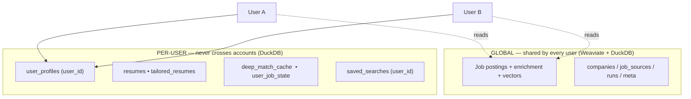
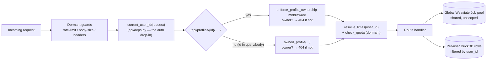

# Multi-tenancy: global jobs, private everything-else, leak-proof by construction

JobScout runs today as a **single local user** who owns everything. There is **no
authentication yet** — but the architecture is already shaped so that adding login
(Google, email, whatever) does **not** leak one user's private data to another. This
document is the map: what's shared, what's private, why it can't leak, and the exact
one-function change that turns on real multi-user hosting.

## The data split



**GLOBAL (shared, correct to share):** the Weaviate `Job` collection — postings,
enrichment, and embeddings — plus `companies`, `job_sources`, `runs`, and `meta`. A
job is fetched and embedded **once** and then serves every user. Nothing here is
user-specific, so there is nothing to leak. This is the whole point: aggregated jobs
are a shared, deduplicated public index.

**PER-USER (private, must never cross accounts):** `user_profiles`, `resumes`,
`tailored_resumes`, `deep_match_cache`, `user_job_state`, and `saved_searches`.
Everything except profiles and saved searches is already keyed by `profile_id`, so
they inherit tenancy automatically the moment a profile has an owner and routes check
it — **no schema change needed** for those child tables.

**"For You" costs no LLM.** The recommendation feed is the *deterministic* verdict
engine (`verdict.py`) — hard gates + weighted fit, embeddings `lru_cache`d. It never
calls an LLM, so it never re-bills per page view. Deep-match (the LLM "second opinion")
is separate, cached per `(job, profile, fingerprint)`, and never recomputed unless the
resume/profile changes.

## Why it can't leak — enforcement in ONE place

A request flows through the seam like this — identity, ownership, then per-account limits,
each resolved in exactly one place (so a new route inherits all three for free):



Every `/api/profiles/{id}/…` route is scoped to one profile, and every profile carries
a `user_id`. Ownership is enforced by a **single HTTP middleware**
(`enforce_profile_ownership` in `api/main.py`): before any profile-scoped handler runs,
it looks up the profile and returns **404** if the caller isn't the owner. Routes that
take the profile id via **query/body** (which the path-only middleware can't see) call
`owned_profile(...)` for the same 404-not-403 guarantee.

- **404, not 403** — a 403 confirms the id exists and lets an attacker enumerate other
  users' ids. A 404 reveals nothing.
- **One choke point** — 24 profile routes (resumes, tailored DOCX download, deep-results,
  pipeline, job-state, tailor, reparse, …) all pass through it, so the entire **IDOR**
  class ("guess someone's profile/resume id and download it") is impossible by
  construction, not by remembering to check in each handler.
- List endpoints (`GET /api/profiles`, `GET /api/saved-searches`) filter by the caller's
  id; saved-search `seen`/`delete` 404 on non-owners too.

### What WOULD leak without this seam

If you bolted Google login on with **no** ownership layer, these would all leak across
accounts:

| Route | Leak |
|---|---|
| `GET /api/profiles` | Every user's profiles (names, preferences, resume text) |
| `GET /api/profiles/{id}/resumes/{rid}/file` | **Download any user's resume** by guessing an id (IDOR) |
| `GET /api/profiles/{id}/tailored/{job}` | Any user's tailored DOCX |
| `POST /api/profiles/{id}/deep-results` | Any user's AI verdicts |
| `GET /api/profiles/{id}/pipeline`, `/jobs/by-state` | Any user's application tracker |
| `PUT /api/settings` | **Writes the server `.env` (API keys!)** |
| `/api/maintenance/*`, `/api/scheduler`, `/api/sources/overrides` | Drain shared quota / purge the global index |

The seam closes the profile rows above via the middleware, and the global-write routes
via `require_admin` (open while `single_user_mode`, 403 once hosting).

## Turning on real multi-user hosting — WIRED (Auth0 + Supabase)

The seam described here is now implemented. `current_user_id` in `api/deps.py` verifies an
Auth0 `Bearer` JWT and resolves/auto-provisions the `users` row; the relational store and
file storage swap to Supabase Postgres/Storage via their factories. It stays inert until the
env vars are set (unset = the single local user, DuckDB, local files). Setup + config matrix:
**[auth-and-hosting.md](auth-and-hosting.md)**.

```python
def current_user_id(request: Request) -> str:
    if not settings.auth0_configured:
        return settings.local_user_id       # local: single user
    token = bearer_token(request)           # else: verify the Auth0 JWT and
    ...                                      # resolve/provision the account (sub→email)
```

Nothing else changed — every route already routed ownership and admin checks through
`deps.py`, and the `users` table already existed (`ensure_local_user`). New accounts are
inserted on first login (`create_auth_user`); create/upload routes stamp `current_user_id`.

## Per-account entitlements, usage metering & the operator console (built)

Every limit — rate/upload/tailor/deep-match/LLM-spend and any future one — resolves
through **one seam**, `entitlements.resolve_limits(user_id, store)`. It returns the global
defaults overlaid with the account's `users.plan` / `users.limits_json`
(`plan='unlimited'` or a `limits_json` key = uncapped). So making limits per-account is a
**data change, not a code change** — the operator sets a plan; every guard reflects it.

Two independent switches (both off by default → byte-identical to today):
- **`usage_metering_enabled`** — *record* per-account usage (`tailor`/`deep_match`/`requests`/…)
  into `usage_counters`, for monitoring. No caps.
- **`quota_enforced`** — *enforce* the resolved per-account caps (implies recording).

The host monitors and administers via **`/api/admin/*`** (`api/admin.py`, `require_admin`-gated:
open to the local operator, `users.is_admin` once hosting) and the frontend **Admin** tab:
list accounts with plan/storage/usage, grant/revoke premium (`PATCH …/users/{id}`), per-user
usage rollups, and deployment aggregates. `GET /api/users/me` reports the caller's admin flag.

### Two things a real hosted deployment still needs (Tier 3)

1. **Per-user quota is seamed but dormant.** Ingestion routes spend shared DeepSeek + Gemini
   quota; turn on `quota_enforced` (and set plans) to cap it per account. A global spend cap +
   real rate limits (Tier-2 flags) belong on before public exposure.
2. **Postgres over embedded DuckDB — BUILT.** `PostgresRelationalStore` (psycopg pool) is used
   whenever `DATABASE_URL`/`SUPABASE_DB_URL` is set; DuckDB stays the local/test fallback. Files:
   `SupabaseBlobStore` (Supabase Storage) via `storage_backend`. See
   [auth-and-hosting.md](auth-and-hosting.md). (DuckDB is embedded + single-writer, so it stays for
   local/dev only, not concurrent multi-user traffic.)

See [pre-deployment-checklist.md](pre-deployment-checklist.md) for the full flip-these-flags /
build-these-items list.

See also: [architecture.md](architecture.md), [data-and-storage.md](data-and-storage.md).
