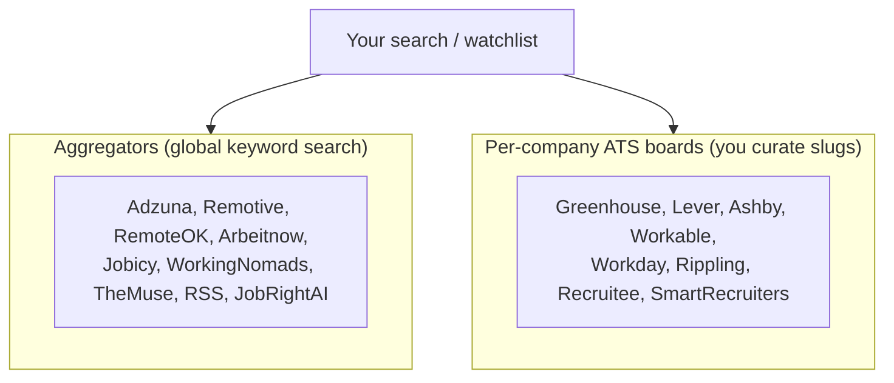

# Sources & adapters

JobScout pulls jobs from 18 adapters. They split into two kinds, which matters for how you add coverage.



**Fallback (textual):**
- **Aggregators** index many companies; you search by keyword and they return matches. Zero curation.
- **Per-company ATS boards** each serve *one* employer, fetched by a **slug** you provide. You curate
  the list — this is how you target specific employers (e.g. cap-exempt universities/nonprofits).

---

## The adapters

| Adapter | Type | Notes |
|---|---|---|
| Greenhouse | ATS | `boards-api.greenhouse.io/v1/boards/{slug}/jobs`. Startup-dense. |
| Lever | ATS | `api.lever.co/v0/postings/{slug}`. |
| Ashby | ATS | `api.ashbyhq.com/posting-api/job-board/{slug}`. |
| Workable | ATS | `apply.workable.com/api/v1/widget/accounts/{slug}`. |
| Workday | ATS (POST) | `{tenant}.{region}.myworkdayjobs.com/wday/cxs/...`; per-job detail fetch. |
| Rippling | ATS | `api.rippling.com/.../board/{slug}/jobs` + detail. |
| Recruitee | ATS | `{slug}.recruitee.com/api/offers/`. |
| SmartRecruiters | ATS | `api.smartrecruiters.com/v1/companies/{slug}/postings` + detail. Reaches **bigger firms** (Visa, ServiceNow). |
| Adzuna | Aggregator | Needs `ADZUNA_APP_ID/KEY`. |
| Remotive / RemoteOK / WorkingNomads / Jobicy | Aggregator | Remote-focused public APIs. |
| Arbeitnow | Aggregator | EU-leaning (few US roles). |
| TheMuse | Aggregator | Public API. |
| RSS | Aggregator | Generic feed reader (e.g. HigherEdJobs). |
| JobRightAI | Aggregator | Parses SSR JSON; **fragile**, ships `enabled: false`. |
| JobSpy | Scraper | High-risk (LinkedIn/Indeed); `enabled: false`. |

All HTTP goes through `CompliantHttpClient` (robots.txt, per-domain rate limit, 429/503 backoff). Adding
an adapter inherits compliance automatically.

---

## Enabling & curating sources

Edit `sources.yaml` (per-source `enabled` + company/account/tenant lists). Per-company entries take a
`{token, type}` shape, where `type` stamps the cap-exempt **employer_type** (e.g. `nonprofit`,
`university`). Example:

```yaml
greenhouse:
  enabled: true
  companies:
    - {token: stripe, size: "5000+"}
    - {token: givewell, type: nonprofit}    # cap-exempt → sponsorship "likely"
```

Auto-discovered companies go in `sources.discovered.yaml` (generated; merged at load).

## Discovery & registry scripts (`scripts/`)

| Script | What it does |
|---|---|
| `discover_companies.py` | Probe slug-based ATS (Greenhouse/Lever/Ashby/Workable/Rippling) from `data/company_seeds.txt`, rank by junior-relevant open roles, write `data/discovered_companies.csv` (+ `--write-sources`). |
| `probe_workday.py` | **Cap-exempt Workday tenant prober.** Reads career-site URLs from `data/workday_cap_exempt_seeds.txt` (`<url> \| <type> \| <Display Name>`), verifies which are live + have keyword-relevant roles, and (`--write-sources`) merges verified tenants into `sources.discovered.yaml`. Universities/AMCs/nonprofit-research are the H-1B cap-exempt classes; `type` stamps cap-exempt and `name` stamps the employer (Workday listings omit it). Add a tenant by Googling "&lt;org&gt; careers workday" → copy the `myworkdayjobs.com` URL into the seed file → re-run. |
| `build_company_registry.py` | Seed the DuckDB `companies` table from the CSV + `data/company_tiers.csv`. |
| `export_weaviate.py` | **Back up the Weaviate index** (jobs **+ vectors** via `include_vector=True`) to `data/weaviate_export.jsonl.gz`. Pure download — **no embedding calls, $0**. Header records the embed model + dim. |
| `import_weaviate.py` | **Restore** from that file, writing vectors back as-is (no re-embed, $0). Refuses if the target index holds a different vector dimension (different embedding model — can't mix). |
| `ingest_discovered.py` | Bounded, budget-capped enriched ingest of discovered boards. |
| `smoke_adapters.py` | Live-test every pure-HTTP adapter (no DB/keys needed). |
| `restamp_sponsors.py` | Backfill `known_h1b_sponsor` on existing jobs (no re-embed). |

## High-risk scraper toggle (JobSpy)

JobSpy (Indeed/Glassdoor scraping) ships **`enabled: false`** and is also gated behind a **runtime
toggle**: Settings → *High-risk scraper (JobSpy)*. OFF by default, resets off on backend restart, and
only then included when you click **Get latest jobs**. Endpoints: `GET/POST /api/sources/overrides`
(`{"jobspy": true}`). Use sparingly — scraping these sites is compliance-sensitive.

## Index cleanup (purge)

`POST /api/maintenance/purge {"days": 60}` deletes jobs older than N days (by `posted_date`, or
`ingested_at` when unknown). Explicit action only — never automatic. Backed by
`WeaviateStore.purge_older_than`.

## Text cleanup

Job titles/companies/descriptions are repaired for mojibake (mis-decoded UTF-8) at ingest via
`normalize.fix_mojibake` (`ftfy`). Dedup also collapses cosmetic repost variations ("(Remote)", bracketed
qualifiers) via `normalize_title`.

## Compliance (non-negotiable)
- robots.txt respected before every crawl; disallowed paths skipped + logged.
- Only unauthenticated public data; no cookies/auth bypass; no PII collection.
- `blocklist.yaml` honored. High-risk sources (JobSpy) are off by default.
