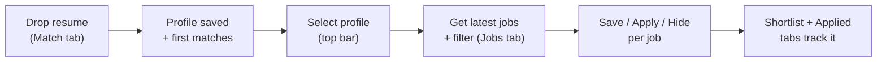

# User guide

End-to-end: from zero to a shortlist of jobs to apply to. Assumes the backend (`:8000`) and frontend
(`:5173`) are running (see the [README](../README.md) quickstart).

---

## The core loop

**Fallback (textual):**
Drop resume (Match) → profile saved + first matches → select that profile in the top bar → Get latest
jobs + filter on the Jobs tab → Save / Apply / Hide each job → review them in the Shortlist and Applied
tabs.

---

## Step 1 — Create a profile by dropping your resume

1. Open the **Match** tab.
2. Drag a **PDF / DOCX / TXT / JSON** resume onto the drop zone (or click to pick).
3. The tool extracts the text, asks DeepSeek to pull your real skills / years / target titles
   (it never invents skills), **saves a profile**, and shows ranked matches with:
   - **green chips** = skills the role wants that your resume has (matches),
   - **amber chips** = skills the role wants that your resume lacks (gaps).
4. A **Delete profile** button is right there if you want to start over.

> Matches are limited to what's currently in the index. If results look thin, run **Get latest jobs**
> first (Step 3), then re-drop your resume.

## Step 2 — Make that profile active

In the **top bar**, pick your profile from the **profile selector**. This makes the whole app
profile-aware:
- The **Jobs** list shows a fit **verdict** (Apply/Flag) + score, matched/gap chips, and sorts
  **cap-exempt employers first** (the ones that can sponsor H-1B off-lottery).
- **Apply / Save / Hide** buttons appear on each job.
- Applied + hidden jobs drop out of the main list automatically.

## Step 3 — Get more jobs

Two ways to pull fresh roles:
- **Get latest jobs** (top bar) — runs ingestion using your profile's target titles.
- **Companies → Refresh watchlist** — pulls *new* jobs from the enabled companies in the registry.

Both only embed **new** jobs (deduped) and are budget-capped so they can't blow the Gemini free-tier
quota (1,000 embeds/day). For hands-off daily updates, enable the scheduler in **Settings** (off by
default; best with a paid embedding tier).

## Step 4 — Refine your search (Jobs tab)

Use the filter pills:
- **Date posted** (incl. last 24h), **Remote**, **Source**, **Experience** (entry/mid/senior/lead),
  **Company size**.
- **Work authorization**: *Hide no-sponsorship* (on by default — drops only explicit refusals +
  citizenship-required) is an exclusion. The three positive signals — *Likely sponsor (cap-exempt)*,
  *Proven H-1B sponsor*, *E-Verify employer* — are **additive (OR)**: enabling more **adds** matching
  jobs, never empties the list. (A university is cap-exempt but not a for-profit H-1B filer, so they're
  unioned, not intersected.)
- The search box does semantic + keyword (hybrid) search.

> **Few cap-exempt results?** The index is mostly for-profit tech, so *Likely sponsor (cap-exempt)* may
> show only a handful. To add university/hospital/nonprofit roles, enable Workday university tenants +
> nonprofit Greenhouse/Lever boards in `sources.yaml` and run **Get latest jobs** (or
> `scripts/ingest_discovered.py`). See [sources.md](sources.md).

## Step 5 — Shortlist and track applications

- Click **Save** on promising jobs → they appear in the **Shortlist** tab.
- Click **Apply ↗** (opens the posting + marks it applied) or **Mark applied** in Shortlist → they move
  to the **Applied** tab and leave the main list.
- The **Applied** tab is your application tracker (replaces a manual spreadsheet / `applied_jobs.md`).

## Step 6 — Manage profiles

The **Profiles** tab lists every saved profile. Set one active, or **Delete** any of them (no account,
fully local — see [data-and-storage.md](data-and-storage.md)).

---

## Tips

- **No profile selected?** Jobs still works as a plain search; Shortlist/Applied prompt you to pick one.
- **Cap-exempt filter shows nothing?** You probably haven't ingested any university/nonprofit jobs yet —
  add some via the Companies registry or discovery (see [sources.md](sources.md)).
- **Text search returns an error after heavy use?** You hit the daily Gemini embed cap; filter-only
  browsing (no search box) still works. Resets next day, or upgrade the tier.
