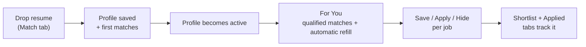

# User guide

End-to-end: from zero to a shortlist of jobs to apply to. Assumes the backend (`:8000`) and frontend
(`:5173`) are running (see the [README](../README.md) quickstart).

---

## The core loop

```mermaid
flowchart LR
    A["Drop resume<br/>(Match tab)"] --> B["Profile saved<br/>+ first matches"]
    B --> C["Profile becomes active"]
    C --> D["For You<br/>qualified matches + automatic refill"]
    D --> E["Save / Apply / Hide<br/>per job"]
    E --> F["Shortlist + Applied<br/>tabs track it"]
```

**Fallback (textual):**
Drop resume (Profile) → profile saved and activated → For You retrieves qualified matches and refills a
sparse/stale index → Save / Apply / Hide each job → review them in the tracker.

---

## Step 1 — Create a profile by dropping your resume

1. Open **Profile**.
2. Drag a **PDF / DOCX / TXT / JSON** resume onto the drop zone (or click to pick).
3. The tool extracts the text, asks the selected LLM provider to pull your real skills / years / target titles
   (it never invents skills), **saves a profile**, and shows ranked matches with:
   - **green chips** = skills the role wants that your resume has (matches),
   - **amber chips** = skills the role wants that your resume lacks (gaps).
4. Use **Edit resume & profile** to keep the full extracted text, detected sections (education, work,
   projects, publications, achievements, and custom headings), skills, target roles, preferences, and the
   original local file together. A **Delete profile** button is right there if you want to start over.

> Matches are limited to what's currently in the index. For You now refills sparse/stale results
> automatically; **Get latest jobs** remains available for an immediate manual run.

## Step 2 — Review the active profile

Uploading a resume activates the new profile automatically; an existing first profile is selected on
first run unless you explicitly choose **No active profile**. The selector can switch profiles later.

- **For You** only shows roles that pass the profile's target-role/profession, experience, seniority,
  verified skill/resume, location, authorization, specialty, and work-mode gates. Background semantic
  fit and interests affect ranking but cannot override a hard mismatch. For a junior profile, a role
  with no stated experience and no explicit junior, Level I, associate, or new-grad signal stays in
  Review instead of entering For You.
- Fit/verdict quality ranks first. Cap-exempt status is a preference/tiebreak, never permission for an
  unrelated hospital or university role to enter the feed.
- **Apply / Save / Hide** buttons appear on each job.
- Applied + hidden jobs drop out of the main list automatically.

## Step 3 — Get more jobs

The sidebar's primary button changes with context, and the helper line under it says which you're
getting:

- **Get latest jobs** (no active profile) — searches every enabled source with **generic tech
  keywords** and indexes whatever comes back. Broad and unfiltered; good for filling Discover.
- **Find profile matches** (a profile is active) — the same button, but it searches with **your
  target roles** and keeps only roles that pass your eligibility gates. Run it when For You feels thin.
- **Refresh watchlist** — re-checks only the companies you watch for newly opened/closed roles. Cheap
  and fast.
- **For You auto-refill** — when qualified results are sparse or older than one day, JobScout searches
  enabled sources with the active profile's target roles. Runs are deduplicated, limited to once per
  profile/evidence fingerprint every six hours, and remain embedding-budget-capped.

**New since last visit** — the For You header shows an "N new since last visit" pill when roles have
been indexed since you last opened the feed; click it to view only those. (Local to this device — the
last-visit time is stored in your browser, not on any server.)

**Deep-match top 10 + AI re-rank** — the For You header has a *Deep-match top 10* button: one click runs
the AI "second opinion" over your top matches, stamps each card with an **AI ✓ / caution / skip** badge
(the detail pane shows the full reasoning), and then **re-ranks the feed by the AI's verdicts** —
Apply → Borderline rise to the top (by AI score), un-analyzed keep their spot in the middle, and Skip
sinks to the bottom. Click again to analyze the **next 10** (the button shows how many are left); every
click re-ranks the whole analyzed set together. A **Ranked by AI ✕** chip reverts to the normal
match/newest order (and toggles back on). It's manual on purpose so you decide when to spend AI calls;
already-analyzed jobs are cached and re-run for free. The AI badges also show in **Discover** for any
job you've analyzed (Discover has no trigger button — deep-match is driven from the ranked For You feed).

All three only embed **new** jobs (deduped) and are budget-capped so they can't blow the Gemini free-tier
quota (1,000 embeds/day). For hands-off daily updates, enable the scheduler in **Settings** (off by
default; best with a paid embedding tier).

## Step 4 — Refine your search (Jobs tab)

Use the filter pills:
- **Date posted** (incl. last 24h), **Remote**, **Source**, **Experience** (entry/mid/senior/lead),
  **Company size**.
- **Work authorization**: *Hide no-sponsorship* is an optional exclusion that drops only explicit
  refusals and citizenship-required roles. The three positive signals — *Likely sponsor (cap-exempt)*,
  *Proven H-1B sponsor*, *E-Verify employer* — are **additive (OR)**: enabling more **adds** matching
  jobs, never empties the list. (A university is cap-exempt but not a for-profit H-1B filer, so they're
  unioned, not intersected.)
- The search box does semantic + keyword (hybrid) search.

> **Few cap-exempt results?** The index is mostly for-profit tech, so *Likely sponsor (cap-exempt)* may
> show only a handful. To add university/hospital/nonprofit roles, enable Workday university tenants +
> nonprofit Greenhouse/Lever boards in `sources.yaml` and run **Get latest jobs** (or
> `scripts/ingest_discovered.py`). See [sources.md](sources.md).

## Step 5 — Shortlist and track applications

- Click **Save** on promising jobs → they appear in the **Shortlist** tab.
- Click **Apply ↗** (opens the posting + marks it applied) or **Mark applied** in Shortlist → they move
  to the **Applied** tab and leave the main list.
- The **Applied** tab is your application tracker (replaces a manual spreadsheet / `applied_jobs.md`).
- **Pipeline stats** sit above the tracker: total applications, response rate, interview rate, offer
  rate, and a per-source breakdown flagged **Direct** vs **Discovery** — so you can see which sources
  actually convert. Rates come straight from the stages you set (applied → OA → interview → offer →
  rejected); no data leaves the machine. Because only the latest stage per job is stored, "reached
  screening/interview" counts jobs *currently* at that stage — a job rejected after an interview reads
  as rejected — so those rates are a conservative floor. Response rate (anything past *applied*) is exact.

### Tailor a resume (PDF + DOCX) with an AI-reduction dashboard

With an active profile, open a job and choose **Tailor**. JobScout first applies the eligibility gate
(US role, no citizenship/clearance/ITAR wall, no explicit no-sponsorship role, and not a 5+ year role).
Only then does the selected chat provider write a job-tailored resume **from your own resume's facts** —
it may reorder and reword, but never invents employers, titles, dates, degrees, or metrics. The default
**LaTeX engine** builds both a **PDF and a DOCX**, runs a warn-only fabrication audit (anything it can't
ground in your resume is flagged for you to confirm), and scores the result.

An **AI-reduction dashboard** then appears under the job: before→after **humanization** rings (100 minus a
composite AI-detection risk score) and the metrics tailoring moved most — sentence burstiness, lexical
diversity, buzzword density, and so on. The goal is a resume that reads human, not machine-generated.

> The engine needs `xelatex` + `pandoc` installed (see configuration.md). Set `TAILOR_ENGINE=node` to use
> the legacy DOCX-only path instead.

### Your dashboard (Profile → Dashboard)

The Profile tab's **Dashboard** card rolls a candidate up in one place: the **application funnel**
(applications, response/interview/offer rates), and **every tailored resume** with its humanization score
and PDF/DOCX links, sorted so the most human-reading resumes are on top.

### Keep several resumes (Profile → Resumes)

**Recommended workflow: keep one profile and add multiple resumes to it** — make separate profiles only
for genuinely different careers. The Profile tab has a **Resumes** card: keep multiple resumes and pick
which one is **active**.

**Where your edits land (two sources of truth):**
- **Matching & deep-match** read your **editable profile** — the active resume's text *plus* any manual
  edits or AI-polish you make in the Profile sections (they sync into the profile). So refining a section
  changes what you get matched to.
- **Tailoring** builds from your **verified canonical facts** (the local resume-writing toolkit), *not*
  the editable profile, and auto-selects only the parts relevant to each job — this is deliberate so the
  audited DOCX never contains invented or embellished content. (Unifying the two is a possible future
  option; today they're intentionally separate.)

- **Upload another** (or drop a file on the card) adds a resume — the first one auto-activates.
- **Set active** switches which resume drives matching; For You re-scores automatically.
- **Rename** (pencil) gives a resume a human label; **download** re-fetches the original file; **delete**
  removes it (deleting the active one promotes the next-newest).
- Uploading the same filename twice does **not** overwrite — both are kept, and the second is
  auto-numbered ("resume (2).docx"). The same applies everywhere a name could collide: duplicate
  profile uploads become "name (2)", and renaming a profile or resume onto a taken name saves it
  suffixed with a small inline note telling you the final name (rename anytime).

Your saved **Tailored resumes** appear in their own card here too: every DOCX you've built, downloadable
anytime with a dated filename (so repeated downloads never collide in your Downloads folder).

> "New profile from resume" (in the identity header) is different — it creates a **separate profile**
> from a resume. Use the Resumes card to add resumes to the profile you're already on.

## Step 6 — Manage profiles

The **Profiles** tab lists every saved profile. Set one active, or **Delete** any of them (no account,
fully local — see [data-and-storage.md](data-and-storage.md)).

**Rename a profile:** click the **pencil** next to the profile name in the Profile header, type a clean
name (e.g. "Marriott SWE"), and press Enter. The new name shows everywhere — the header, the avatar
initials, the switcher, and the sidebar "Matching profile" selector. (This is separate from renaming a
*resume* in the Resumes card.)

---

## Tips

- **No profile selected?** Jobs still works as a plain search; Shortlist/Applied prompt you to pick one.
- **Cap-exempt filter shows nothing?** You probably haven't ingested any university/nonprofit jobs yet —
  add some via the Companies registry or discovery (see [sources.md](sources.md)).
- **Text search returns an error after heavy use?** You hit the daily Gemini embed cap; filter-only
  browsing (no search box) still works. Resets next day, or upgrade the tier.

## Structured profile editing (Profile tab)

Uploading a resume (or clicking **✨ Structure my resume** on an older profile — 1 AI call) parses it
into typed, individually editable sections: **Education** (per school: degree, field, GPA, dates),
**Experience** (per role: company, dates, bullets), **Projects** (tech pills, GitHub/Live links),
**Certifications**, **Skills as per-category pills**, plus custom sections. Every editor is a
master-detail modal (entry list left, fields right, add/delete). Edits recompose the canonical
resume text automatically, so semantic matching always reflects what you see. The **Raw text**
button remains the bulk-edit escape hatch (saving re-derives the sections).

**AI bullet polish**: in Experience/Projects editors, *Improve bullets* (1 AI call) suggests
tightened wording under strict truthfulness rules (no invented facts/metrics) and shows a per-bullet
diff — accept or keep each one; nothing saves until *Save changes*.

**AI suggestions for preference lists**: the edit modals for **Interests**, **Deep-match steering**
(role types / domains to avoid), **Target roles**, and **Skills** have a *Suggest with AI (1 call)*
button. Suggestions are grounded in your resume and **add-only** — shown as dashed chips you click to
add (or *Add all*); your existing entries are never edited or removed. These fields aren't auto-filled
at upload on purpose: avoid-lists and interests are *preferences*, not resume facts, so you stay in
control of what goes in.

## Tailor pre-flight gate

*Tailor DOCX* first runs the rule verdict + deep match. A **skip** conclusion lists the walls
(sponsorship refusal, defense/ITAR domain, seniority/stack mismatch) with *Tailor anyway* / *Skip* —
the document only builds when you say so.

## First-run

On a fresh deployment the index starts empty, so JobScout runs a **one-time background seed**: with an
embedding key configured, it fetches ~150 recent jobs from the fastest keyless sources so the app isn't
empty on first open. A "Fetching your first jobs…" banner shows while it runs; it happens once. (Jobs
are never shipped as a committed snapshot — they go stale; the index is filled live and kept to a
rolling recent window via retention. See [data-and-storage.md](data-and-storage.md).)

For You without a profile shows the 3-step onboarding (upload → automatic fetch & screening → For
You vs Discover). A setup banner at the top of the app tells you exactly which API key or service is
missing and how to fix it (see configuration.md for the key matrix).

## Publications, achievements & certifications

The resume parser routes each item by *what it is*, not by the heading it sat under: papers /
conference / journal / DOI → **Publications**; awards, scholarships, competition wins → **Achievements**;
licenses and course credentials → **Certifications**. A combined "Achievements & Publications" heading is
split item by item. Anything that matches none of these keeps its own **Custom section**.

## Import already-applied jobs

Tracker → **Import applied**: paste your markdown tracker table (`| Date | Company | Role | Link | Notes |`).
Rows are matched by link first, then company + role, and marked *applied* so they leave the feed. No AI
call, nothing leaves the machine.

## Help

The sidebar's **How JobScout works** explains the loop, every tab, every badge, and the action buttons —
it is the fastest way to onboard someone new.
